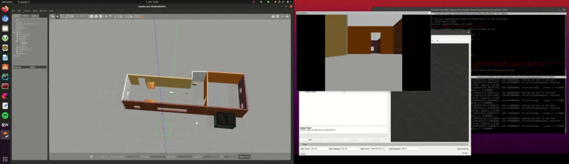

# Robotics Software Engineer

## Project 2 - Go Chase It!
 
Design and build a mobile robot, and house it in your world. Then, program your robot with C++ nodes in ROS to chase white colored balls!
  
[]